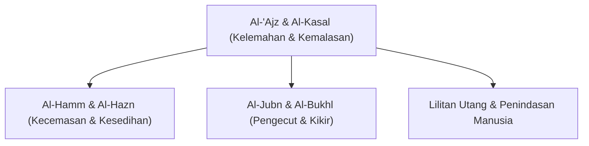

# Al-Ajz wal Kasal (Kelemahan & Kemalasan)

## Definisi

**Al-'Ajz** (Kelemahan/Ketidakmampuan) dan **Al-Kasal** (Kemalasan) adalah dua penyakit mental-spiritual yang menjadi akar dari segala kegagalan manusia dalam meraih kebaikan di dunia maupun akhirat. Keduanya menghalangi manusia dari melakukan amal saleh dan ikhtiar yang bermanfaat.

- **Al-'Ajz**: Kondisi di mana seseorang tidak mampu menempuh sebab-sebab kebaikan karena keterbatasan kemampuan fisik, sarana, atau kecerdasan.
- **Al-Kasal**: Kondisi di mana seseorang sebenarnya memiliki kemampuan fisik dan sarana untuk beramal, namun ia tidak memiliki kehendak, motivasi, atau kemauan untuk melakukannya.

## Rantai Delapan Keburukan

Dalam hadis yang diriwayatkan oleh **[[Anas bin Malik]]**, **[[Nabi Muhammad SAW]]** mengajarkan doa perlindungan dari delapan keburukan yang saling berpasangan dan bersumber dari kelemahan serta kemalasan:

### 1. Al-Hamm (Kecemasan) & Al-Hazn (Kesedihan)
- **Al-Hazn (Kesedihan)**: Rasa perih di hati akibat memikirkan peristiwa buruk yang telah terjadi di masa lalu. Hal ini tidak mendatangkan manfaat karena masa lalu tidak dapat diubah, melainkan harus disikapi dengan rida terhadap **[[Qadar]]**.
- **Al-Hamm (Kecemasan)**: Rasa takut di hati akibat membayangkan ketidakpastian buruk yang akan terjadi di masa depan. Keduanya melumpuhkan tekad jalan hidup seorang mukmin.

### 2. Al-Jubn (Pengecut) & Al-Bukhl (Kikir)
- **Al-Jubn (Pengecut/Penakut)**: Kelemahan dalam mendarmabaktikan fisik dan tenaga untuk membela kebenaran atau menolong orang lain.
- **Al-Bukhl (Kikir/Pelit)**: Kelemahan dalam mendarmabaktikan harta di jalan kebaikan.

### 3. Lilitan Utang & Penindasan Manusia
Akibat akhir dari hilangnya produktivitas karena lemah dan malas adalah terjatuh pada kehinaan:
- **Lilitan Utang**: Penindasan secara hak/adil akibat ketidakmampuan finansial.
- **Penindasan Manusia**: Penjajahan secara zalim/salah dari orang lain yang memanfaatkan kelemahan dirinya.

## Hikmah Ujian Hati

**[[Ibnul Qayyim Al-Jauziyyah]]** menjelaskan bahwa Allah kadang menimpakan kecemasan (*Hamm*) dan kesedihan (*Hazn*) ke dalam hati hamba yang berpaling dari-Nya sebagai bentuk "penjara spiritual". Hal ini bertujuan untuk menghentikan mereka dari kemaksiatan, memaksa mereka agar kembali tunduk, merasa butuh (*iftiqar*), dan memurnikan tauhid kepada Allah semata demi meraih kedamaian hakiki.

## Solusi Syariat

Untuk memutus mata rantai penyakit ini, Islam mengajarkan:
1. **Istia'dzah Aktif**: Rutin membaca doa perlindungan dari kelemahan dan kemalasan.
2. **Kecerdasan & Daya Guna (Resourcefulness)**: Berusaha sekuat tenaga menyusun strategi dan taktik hidup yang baik.
3. **Tawakkul Aktif**: Menggabungkan ikhtiar keras dengan penyerahan diri total kepada Allah, rida dengan takdir setelah kejadian berlangsung.

## Sumber

- [[Mengenai Petunjuk-Nya dalam Menjaga Firman-Nya]]
