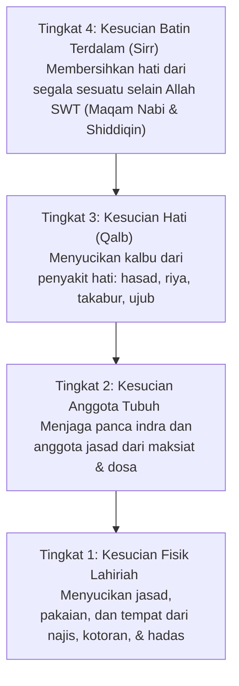

# Taharah

Kegiatan menyucikan diri dari hadas dan najis secara lahiriah serta menyucikan kalbu dari noda dosa dan selain Allah secara batiniah.

## Definisi

**Taharah** (bahasa Arab: طهارة) secara bahasa berarti bersuci atau bersih. Dalam terminologi fikih Islam, Taharah adalah mengangkat hadas (dengan wudhu, mandi, atau tayammum) dan menghilangkan najis/kotoran dari tubuh, pakaian, serta tempat shalat agar ibadah dinilai sah di hadapan Allah SWT. 

## Kedudukan Spiritual bersuci

Islam menempatkan kebersihan pada derajat keimanan tertinggi:
*   **Pintu Ibadah**: Rasulullah ﷺ bersabda:
    > *"Kebersihan/kesucian adalah sebagian dari iman."* (HR. Muslim)
    > *"Kunci dari shalat adalah bersuci."* (HR. Tirmidzi)
*   **Kecintaan Allah**: Allah SWT berfirman mengenai masjid Quba:
    > *"Di dalamnya ada orang-orang yang ingin membersihkan diri. Allah menyukai orang-orang yang bersih."* (QS. At-Taubah: 108).

## Empat Tingkat Kesucian (Perspektif Al-Ghazali)

Dalam kitab *Ihya' Ulumiddin*, **[[Imam Al-Ghazali]]** menjelaskan bahwa bersuci memiliki kedalaman esensi batin yang terbagi menjadi empat tingkatan bertingkat:

Ghazali memperingatkan agar seorang Muslim tidak terjebak pada **Tingkat 1** (menggosok pakaian dan badan secara berlebihan) sambil membiarkan hatinya (**Tingkat 3** & **Tingkat 4**) dipenuhi kotoran kesombongan, dendam, dan kemunafikan.

## Hukum Najis Lahiriah

Untuk kesucian fisik, syariat membagi zat di alam semesta berdasarkan status kesuciannya:

### 1. Status Hukum Benda
*   **Benda Mati**: Semua zat mati di bumi adalah suci, kecuali khamr (minuman keras) dan segala zat cair yang memabukkan.
*   **Benda Hidup**: Semua hewan berstatus suci selama hidupnya, kecuali anjing, babi, serta keturunan dari keduanya.
*   **Bangkai**: Semua jasad hewan yang mati tanpa disembelih secara syar'i adalah najis, kecuali bangkai manusia, belalang, ikan, ulat makanan, dan bangkai serangga yang tidak memiliki darah mengalir (seperti lalat, semut, lebah).

### 2. Najis yang Dimaafkan (Ma'fu 'Anhu)
Ghazali merinci kelonggaran fikih bagi kotoran kecil yang sulit dihindari agar tidak mempersulit ibadah (*taysir*):
*   Sisa bau tipis yang tertinggal setelah menggosokkan batu istinja.
*   Debu atau kotoran kering di jalanan umum.
*   Kotoran jalanan yang menempel di bawah sepatu/kaus kaki kulit setelah digosokkan ke tanah kering.
*   Darah kutu, kepinding, atau nyamuk dalam jumlah wajar pada pakaian.
*   Darah/nanah ringan yang keluar dari jerawat atau bisul pribadi.

## Alat dan Sarana Bersuci

1.  **Air Mutlak**: Air suci yang menyucikan (seperti air hujan, air sumur, air laut). Air mutlak yang mengalir dinilai najis hanya jika warna, rasa, atau baunya berubah. Air diam yang volumenya kurang dari dua qullah (sekitar 216 liter) menjadi najis seketika saat dijatuhi najis, sekalipun tidak berubah sifatnya.
2.  **Benda Padat (Batu Istinja)**: Batu yang kering, suci, keras, dan didapatkan secara halal.

## Lihat Juga

*   [[Apa yang Tidak Disadari Muslim tentang Diri Mereka]]

## Sumber

*   **[[Mysteries-of-Cleanliness-and-Purification]]**
*   **[[Purification-of-the-Body-from-Excrements]]**
