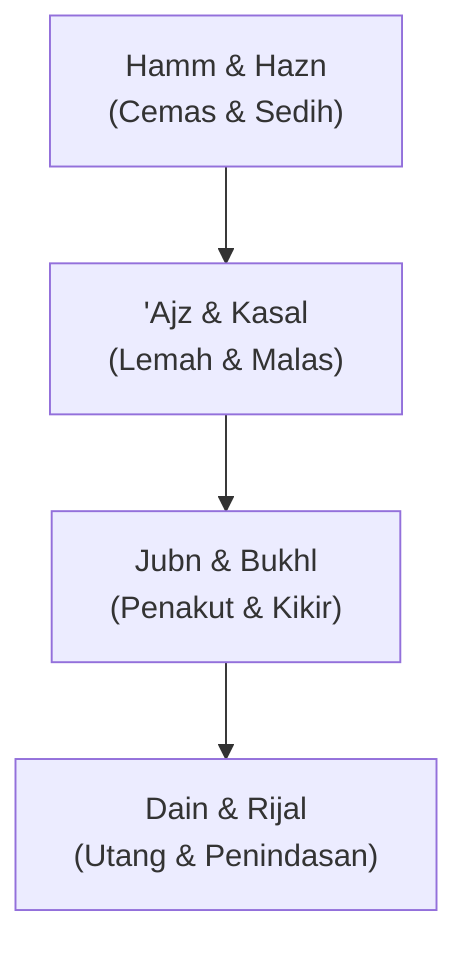

# Memutus Rantai Delapan Belenggu: Ritual Sepuluh Detik yang Mengubah Arah Hidup

Setiap pagi, sebelum layar ponsel menyala merah dan notifikasi WhatsApp berdering nyaring, ada momen hening selama sepuluh detik. Di saat itulah arah hidup Anda ditentukan. Kebanyakan orang memulai hari dengan cemas. Mereka memikirkan tumpukan pekerjaan yang belum selesai, tagihan bulanan yang mendekat, atau penyesalan atas keputusan kemarin yang berujung salah. Tubuh mereka masih di tempat tidur, tetapi pikiran mereka sudah terseret ke masa lalu yang mati dan masa depan yang belum lahir.

Islam menawarkan ritual sepuluh detik yang memotong seluruh drama mental tersebut. Ritual ini bernama Istia'dzah aktif. Sebuah doa sederhana yang diucapkan setiap pagi dan petang, yang merinci delapan musuh terbesar produktivitas manusia: kecemasan (*hamm*), kesedihan (*hazn*), kelemahan (*'ajz*), kemalasan (*kasal*), kepengecutan (*jubn*), kekikiran (*bukhl*), lilitan utang, dan penindasan manusia.

## Rantai Domino Keburukan

Doa ini bukan sekadar susunan kata, melainkan sebuah analisis psikologis yang presisi. Nabi Muhammad ﷺ menyusun delapan keburukan tersebut dalam urutan sebab-akibat yang logis. Jika Anda membiarkan satu kartu domino jatuh, kartu lainnya akan ikut roboh.

1. **Pikiran Melumpuhkan Hati**: Masa lalu yang disesali melahirkan kesedihan (*hazn*). Masa depan yang ditakuti melahirkan kecemasan (*hamm*). Keduanya menguras energi mental Anda di tempat tidur.
2. **Mental Merusak Fisik**: Energi yang habis untuk cemas dan bersedih membuat tubuh Anda kehilangan kemampuan bertindak (*'ajz*) dan kehilangan kemauan untuk memulai (*kasal*). Anda menunda pekerjaan. Anda membiarkan meja kerja berantakan.
3. **Karakter Menjadi Kerdil**: Saat kelemahan dan kemalasan menguasai tubuh, Anda menjadi penakut (*jubn*) untuk mengambil keputusan sulit, dan kikir (*bukhl*) untuk membagikan waktu serta harta demi menolong orang lain. Anda menarik diri ke dalam cangkang egois.
4. **Kehilangan Kemerdekaan Hidup**: Ujung dari ketidakproduktifan ini adalah kehinaan nyata di dunia nyata. Utang mulai melilit pinggang (*dhal'id dain*), dan pada akhirnya, Anda tunduk di bawah kendali dan penindasan orang lain (*ghalabatir rijal*). Anda kehilangan kemerdekaan untuk menentukan hidup sendiri.

## Cara Menjalankan Istia'dzah Aktif

Banyak orang membaca doa ini seperti mesin otomatis—bibir bergerak, pikiran melayang. Itu bukan Istia'dzah aktif. Untuk menjadikannya kebiasaan yang mengubah hidup, ubah cara Anda melafalkannya:

* **Sebutkan Musuh Anda**: Bacalah setiap pagi setelah subuh dan setiap sore setelah ashar. Ucapkan dengan suara lirih namun terdengar oleh telinga sendiri. 
* **Sadari Posisi Domino Anda**: Saat menyebut *hamm* (kecemasan), bayangkan apa yang sedang Anda takuti hari ini, lalu serahkan hasilnya kepada Allah (**[[Tawakkul]]**). Saat menyebut *kasal* (kemalasan), akui bahwa rasa malas itu ada, lalu paksa tubuh Anda berdiri untuk mengambil air wudhu atau mulai menulis baris pertama pekerjaan Anda.
* **Jadikan Benteng Kognitif**: Pahami bahwa ketika Anda membiarkan diri cemas selama satu jam, Anda sedang berjalan sukarela menuju lilitan utang dan penjajahan mental oleh orang lain di masa depan.

Ritual sepuluh detik ini tampaknya kecil dan tidak konvensional dibanding buku-buku produktivitas setebal ratusan halaman. Namun, secara konsisten memutus rantai delapan belenggu ini setiap hari akan mengembalikan kendali hidup ke tangan Anda sendiri. Anda tidak lagi menjadi korban dari masa lalu atau tawanan dari masa depan.
